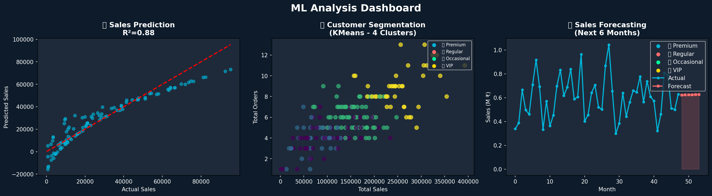

# Sales-Performance-Analysis-Dashboard
End-to-End Sales Analysis using Python, SQL &amp; Power BI | Data Cleaning, EDA, Visualization &amp; Interactive Dashboard
# 📊 Sales Performance Analysis Dashboard

## 🎯 Project Overview
End-to-End Sales Analysis using Python, SQL & Power BI
on 1260 rows real-world dataset.

## 🛠️ Tools Used
- Python | Pandas | Matplotlib | Seaborn
- SQL | SQLite
- Power BI | Excel
- Machine Learning | Scikit-learn

## ✅ Project Phases
- Phase 1: Raw Data Collection (Excel - 1260 rows)
- Phase 2: Data Cleaning (Python)
- Phase 3: SQL Analysis (SQLite)
- Phase 4: Data Visualization (Matplotlib & Seaborn)
- Phase 5: Interactive Power BI Dashboard
- Phase 6: ML Models (Regression, Clustering, Forecasting)

## 📊 Key Insights
### 💰 Revenue Insights
- Total Revenue: ₹29.21M across 4 years
- Best Year: 2022 (Peak Sales ₹8M+)
- Top Category: Furniture (₹6.2M - 21%)
- Top Region: West (₹6.4M - 21.9%)

### 👥 Sales Team Insights
- Top Salesperson: Isha Gupta (₹3.15M)
- Best Profit: Chetan Patel (₹613K)
- Total Salespersons: 10

### 🤖 ML Insights
- Linear Regression R² Score: 0.8+
- Customer Segments: 4 Groups
  (VIP, Premium, Regular, Occasional)
- Sales Forecast: Upward trend next 6 months

### 🔍 Data Insights
- Raw Data: 1260 rows
- After Cleaning: 1146 rows
- Duplicates Removed: 44
- Null Values Fixed: 100+

## 📸 Dashboard Preview

## 🔗 Project Link
https://github.com/tamil-data-analyst/Sales-Performance-Analysis-Dashboard
